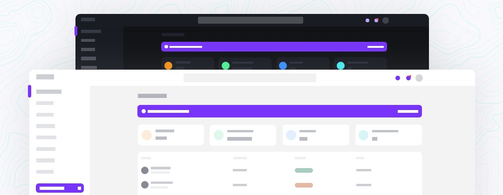

### Como utilizar esta plantilla

Para utilizar la plantilla se debe utilizar una version mas baja de node.js

Para utilizar varias versiones de node se puede utilizar nvm, que es un manejador de versiones de node

https://github.com/coreybutler/nvm-windows/releases/download/1.1.7/nvm-setup.zip

La versión que me funciono correctamente es la 16.14.0

Para instalar una versión con nvm se utiliza el comando asi:

- nvm install 16.14.0

Y para ver las versiones que se tengan instaladas de node es con el siguiente comando:

- nvm list

Para seleccionar otra versión para utilizar de node es el comando:

- nvm use 16.14.0

<p align="center">
    <h1>Windmill Dashboard Next.js Typescript</h1>
    <a href="https://windmill-dashboard-nextjs-typescript.vercel.app/example">
      
    </a><br>
</p>

## 📚 Docs

### General components

Windmill Dashboard React is built on top of [Windmill React UI](https://windmillui.com/react-ui). You will find the documentation for every small component there.

### Example Boilerplate

All components and containers are saved in folder [example](example)

### Routing

Change default redirecting when hit the `/` or `home` in file [next.config.js](next.config.js)

```js
  async redirects() {
    return [
      {
        source: '/',
        destination: '/example/login',
        permanent: false,
      },
    ]
  }
```

#### Sidebar routes

To configure sidebar menus, see file ([routes/sidebar.tsx](routes/sidebar.tsx)).

These are the routes that will show in the sidebar. They expect three properties:

- `path`: the destination;
- `name`: the name to be shown;
- `icon`: an icon to illustrate the item

Item that are used as dropdowns, like the Pages option, don't need a `path`, but expect a `routes` array of objects with `path` and `name`:

```js
// sidebar.js
{
  path: '/example/tables',
  icon: 'TablesIcon',
  name: 'Tables',
},
{
  icon: 'PagesIcon', // <-- this is used as a submenu, so no path
  name: 'Pages',
  routes: [
    // submenu
    {
      path: '/example/login',
      name: 'Login', // <-- these don't have icons
    },
    {
      path: '/example/create-account',
      name: 'Create account',
    },
```

This is a [Next.js](https://nextjs.org/) project bootstrapped with [`create-next-app`](https://github.com/vercel/next.js/tree/canary/packages/create-next-app).

## Getting Started

First, install dependencies :

```bash
npm install
# or
yarn install
```

then, you can run the development server:

```bash
npm run dev
# or
yarn dev
```

Open [http://localhost:3000](http://localhost:3000) with your browser to see the result.

You can start editing the page by modifying `pages/index.tsx`. The page auto-updates as you edit the file.

[API routes](https://nextjs.org/docs/api-routes/introduction) can be accessed on [http://localhost:3000/api/hello](http://localhost:3000/api/hello). This endpoint can be edited in `pages/api/hello.ts`.

The `pages/api` directory is mapped to `/api/*`. Files in this directory are treated as [API routes](https://nextjs.org/docs/api-routes/introduction) instead of React pages.

## Learn More

To learn more about Next.js, take a look at the following resources:

- [Next.js Documentation](https://nextjs.org/docs) - learn about Next.js features and API.
- [Learn Next.js](https://nextjs.org/learn) - an interactive Next.js tutorial.

You can check out [the Next.js GitHub repository](https://github.com/vercel/next.js/) - your feedback and contributions are welcome!

## Deploy on Vercel

The easiest way to deploy your Next.js app is to use the [Vercel Platform](https://vercel.com/new?utm_medium=default-template&filter=next.js&utm_source=create-next-app&utm_campaign=create-next-app-readme) from the creators of Next.js.

Check out our [Next.js deployment documentation](https://nextjs.org/docs/deployment) for more details.
